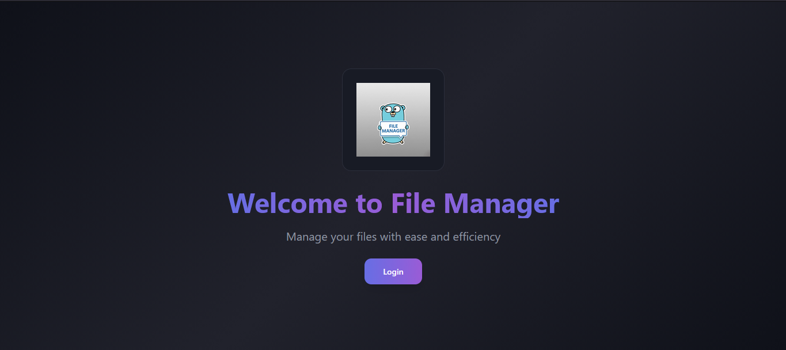
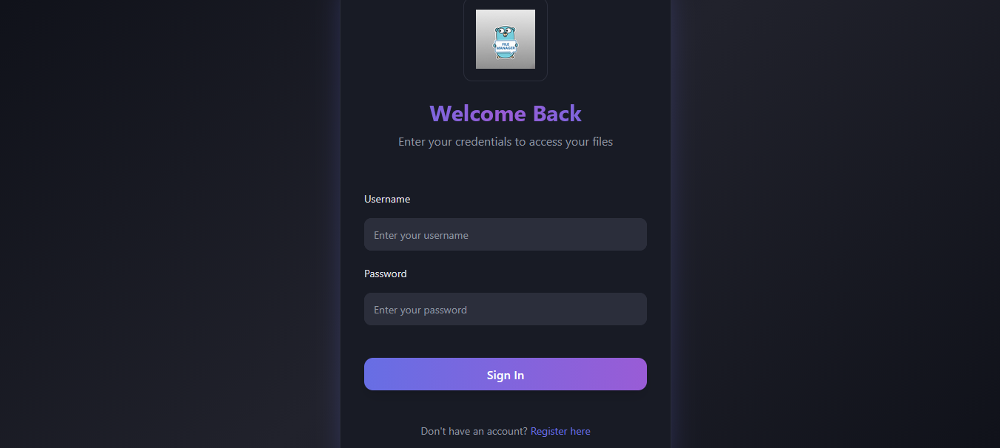
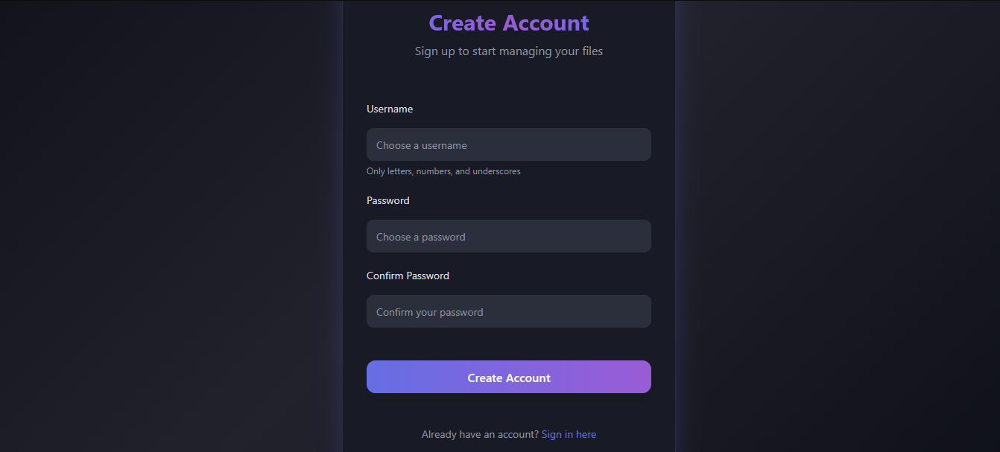
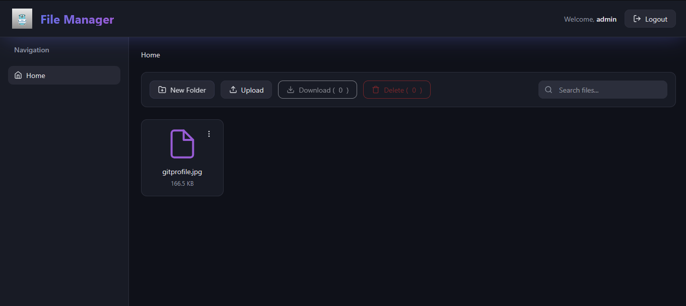

# 📁 File Manager Server

A complete file management server with modern web interface, per-user authentication and complete data isolation. Developed in Go with pure HTML/CSS/JavaScript frontend.



## 📋 Table of Contents

- [Features](#-features)
- [Technologies](#-technologies)
- [Installation](#-installation)
- [How to Use](#-how-to-use)
- [Authentication System](#-authentication-system)
- [Token System](#-token-system)
- [Credential Management](#-credential-management)
- [File Management](#-file-management)
- [Project Structure](#-project-structure)
- [API Endpoints](#-api-endpoints)
- [Security](#-security)
- [Development](#-development)

---

## ✨ Features

- 🔐 **Per-user authentication** - Each user has unique credentials
- 🗂️ **Complete isolation** - Each user only sees their own files
- 🎨 **Modern interface** - Elegant design with gradients and animations
- 📤 **File upload** - Support for multiple simultaneous files
- 📥 **Download** - Individual or multiple downloads
- 🗑️ **Complete management** - Create folders, rename, delete
- 🔍 **Search** - Quick search for files and folders
- 💾 **Persistence** - Credentials saved in JSON, files on disk
- ⏰ **Token expiration** - Automatic security (24 hours)





---

## 🛠️ Technologies

### Backend
- **Go 1.21+** - Main language
- **net/http** - Native HTTP server
- **JSON** - Credential persistence

### Frontend
- **HTML5** - Structure
- **CSS3** - Styling (custom design system)
- **JavaScript (Vanilla)** - Logic and interactivity
- **Bootstrap 5.3.2** - Grid and utilities

---

## 📦 Installation

### Prerequisites

- **Go 1.21 or higher** - [Download](https://golang.org/dl/)
- **Modern browser** - Chrome, Firefox, Edge, Safari

### Steps

1. **Clone the repository:**
   ```bash
   git clone <repository-url>
   cd GoCloudComputingServers
   ```

2. **Install dependencies:**
   ```bash
   go mod tidy
   ```

3. **Run the server:**
   ```bash
   go run main.go
   ```

   Or compile and run:
   ```bash
   go build -o filemanager.exe
   ./filemanager.exe
   ```

4. **Access the interface:**
   ```
   http://localhost:8080
   ```

### Command Line Options

```bash
go run main.go -port 8080 -web ./web -data ./data
```

- `-port`: Server port (default: 8080)
- `-web`: Web files directory (default: ./web)
- `-data`: Data directory (default: ./data)

---

## 🚀 How to Use

### 1. First Use

1. Open `http://localhost:8080` in your browser
2. Click **"Login"** or **"Register"**

### 2. Login as Administrator

The administrator user is created automatically:

- **Username:** `admin`
- **Password:** `admin`

⚠️ **Important:** Change the admin password in production!

### 3. Create New Account

1. Click **"Register"** on the home page or login page
2. Fill in:
   - **Username:** Only letters, numbers and underscore
   - **Password:** Minimum 3 characters
   - **Confirm Password:** Must match
3. Click **"Create Account"**
4. You will be redirected to login

### 4. Using the Dashboard



#### Available Operations:

- **📁 Create Folder:** Click "New Folder"
- **📤 Upload:** Click "Upload" and select files
- **📥 Download:** Select files and click "Download"
- **🗑️ Delete:** Select files and click "Delete"
- **✏️ Rename:** Click the three dots (⋮) → "Rename"
- **🔍 Search:** Use the search bar
- **📂 Navigate:** Click folders or use the sidebar

---

## 🔐 Authentication System

### How It Works

The system uses **token-based authentication**. Each user receives a unique token after successful login.

#### Login Flow:

```
1. User enters credentials
   ↓
2. Frontend sends: POST /api/login
   {
     "username": "joao",
     "password": "senha123"
   }
   ↓
3. Backend validates credentials
   ↓
4. If valid, generates unique token
   ↓
5. Token stored:
   - On server (memory)
   - In browser (localStorage)
   ↓
6. Redirects to dashboard
```

#### Credential Validation:

- Checks if user exists
- Compares password (in plain text - see [Security](#-security))
- Generates random 32-byte token (base64)

### Admin User

The `admin` user is special:

- Created automatically when server starts
- Credentials: `admin` / `admin`
- Cannot be created again via registration
- Has access only to its own directory: `data/files/admin/`

---

## 🎫 Token System

### What Is a Token?

A token is a **"temporary identity ticket"** that:

1. **Authenticates** - Proves you logged in
2. **Identifies** - Tells the server who you are
3. **Authorizes** - Allows access to your resources

### Token Structure

```go
Token {
    Value:     "abc123xyz789...",  // Unique token (32 bytes, base64)
    Username:  "joao",              // Associated user
    ExpiresAt: 2024-01-16 10:00     // Expires in 24 hours
}
```

### How It Works

#### Generation:
- Random 32-byte token
- Base64 encoded
- Associated with username
- Expires in 24 hours

#### Usage:
Each API request includes the token in the header:
```
GET /api/files?path=root
Headers: {
  Authorization: Bearer abc123xyz789...
}
```

#### Validation:
1. Server extracts token from header
2. Checks if it exists in memory
3. Checks if it hasn't expired
4. Identifies the user
5. Returns that user's resources

### Expiration

**⚠️ IMPORTANT:** Tokens expire after **24 hours**, but:

- ✅ **Files DO NOT disappear** - They remain stored
- ✅ **Credentials DO NOT disappear** - They remain in JSON
- ⏰ **Only the session expires** - Need to login again

After expiration:
1. Token becomes invalid
2. User is redirected to login
3. New login generates new token
4. **All files remain in the same place** ✅

### Logout

When logging out:
1. Token is revoked on server
2. Token removed from localStorage
3. Redirected to login

---

## 👤 Credential Management

### Where They Are Stored

Credentials are stored in **two locations**:

#### 1. JSON File (Persistent)
**Location:** `data/files/admin/USER_CREDS.json`

**Format:**
```json
[
  {
    "Username": "admin",
    "Password": "admin"
  },
  {
    "Username": "joao",
    "Password": "senha123"
  },
  {
    "Username": "maria",
    "Password": "password456"
  }
]
```

**Characteristics:**
- ✅ Persists after server restart
- ✅ Automatically loaded on startup
- ✅ Automatically saved when creating new user
- ⚠️ Passwords in plain text (see [Security](#-security))

#### 2. Server Memory (Temporary)
**Location:** Server RAM (`AuthManager.users`)

**Characteristics:**
- Loaded from JSON on startup
- Updated when new users are created
- Lost on server restart (but reloaded from JSON)

### User Creation

When a new user registers:

1. Validation:
   - Username: only letters, numbers, underscore
   - Password: minimum 3 characters
   - Username cannot be "admin"
   - Username cannot already exist

2. Creation:
   - Added to memory
   - Saved to `USER_CREDS.json`
   - Created directory: `data/files/{username}/`

3. Persistence:
   - Credentials saved permanently
   - Available after server restart

---

## 📂 File Management

### Directory Structure

```
data/
  files/
    admin/
      USER_CREDS.json    ← Credentials of all users
      (admin's files)
    joao/
      (joao's files)
    maria/
      (maria's files)
    ...
```

### Data Isolation

**Each user has:**
- ✅ Own directory: `data/files/{username}/`
- ✅ Access only to their files
- ✅ Complete isolation between users

**Example:**
- User "joao" sees only: `data/files/joao/`
- User "maria" sees only: `data/files/maria/`
- They cannot see each other's files

### File Operations

#### List Files
```
GET /api/files?path=root&token=...
```
- Returns list of files and folders
- Sorted: folders first, then files
- Filtered by search (if applicable)

#### Upload
```
POST /api/files/upload?path=root&token=...
Content-Type: multipart/form-data
```
- Supports multiple files
- Maximum size: 10 MB per file
- Saved to user directory

#### Download
```
GET /api/files/download?path=root&name=ficheiro.pdf&token=...
```
- Direct file download
- Files only (not folders)

#### Create Folder
```
POST /api/files/folder
{
  "path": "root",
  "folderName": "NovaPasta"
}
```
- Creates folder in user directory
- Name validation (no special characters)

#### Delete
```
DELETE /api/files
{
  "path": "root",
  "names": ["ficheiro1.pdf", "pasta1"]
}
```
- Deletes files and folders
- Supports multiple items
- Frontend confirmation

#### Rename
```
POST /api/files/rename
{
  "path": "root",
  "oldName": "ficheiro.pdf",
  "newName": "novo_nome.pdf"
}
```
- Renames files and folders
- New name validation

### File Persistence

**✅ Files are PERMANENT:**
- Stored on disk
- Do not disappear when tokens expire
- Do not disappear on server restart
- Only removed if:
  - User manually deletes
  - Administrator deletes
  - Disk runs out of space

---

## 📁 Project Structure

```
GoCloudComputingServers/
├── main.go                 # Server entry point
├── go.mod                  # Go dependencies
├── .gitignore             # Files ignored by Git
├── README.md              # This file
│
├── server/                 # Go server code
│   ├── server.go          # Main HTTP server
│   ├── api.go             # REST API endpoints
│   ├── auth.go            # Authentication system
│   └── filemanager.go     # File management
│
├── web/                    # Web interface
│   ├── index.html         # Home page
│   ├── index.css          # Home page styles
│   ├── index.js           # Home page JavaScript
│   │
│   ├── login.html         # Login page
│   ├── login.css          # Login styles
│   ├── login.js           # Login JavaScript
│   │
│   ├── register.html      # Registration page
│   ├── register.css       # Registration styles
│   ├── register.js        # Registration JavaScript
│   │
│   ├── dashboard.html     # Main dashboard
│   ├── dashboard.css      # Dashboard styles
│   ├── dashboard.js       # Dashboard JavaScript
│   │
│   └── gopher-logo.jpg    # Project logo
│
├── data/                   # Data (created automatically)
│   └── files/             # User files
│       ├── admin/         # Admin files
│       │   └── USER_CREDS.json  # Credentials
│       ├── joao/          # User "joao" files
│       └── maria/         # User "maria" files
│
└── images/                 # Documentation images
    ├── welcome.png
    ├── login.png
    └── files.png
```

---

## 🔌 API Endpoints

### Authentication

#### `POST /api/login`
Logs in and receives token.

**Request:**
```json
{
  "username": "joao",
  "password": "senha123"
}
```

**Response:**
```json
{
  "success": true,
  "token": "abc123xyz789...",
  "message": "Login successful"
}
```

#### `POST /api/register`
Creates new user.

**Request:**
```json
{
  "username": "novo_user",
  "password": "senha123"
}
```

**Response:**
```json
{
  "success": true
}
```

#### `POST /api/logout`
Logs out and revokes token.

**Headers:**
```
Authorization: Bearer {token}
```

**Response:**
```json
{
  "success": true
}
```

### Files

#### `GET /api/files`
Lists files in a folder.

**Query Parameters:**
- `path`: Folder path (default: "root")
- `token`: Authentication token

**Response:**
```json
{
  "success": true,
  "items": [
    {
      "id": "documento.pdf",
      "name": "documento.pdf",
      "type": "file",
      "size": "2.5 KB",
      "modified": "2024-01-15"
    },
    {
      "id": "pasta1",
      "name": "pasta1",
      "type": "folder",
      "modified": "2024-01-15"
    }
  ]
}
```

#### `POST /api/files/upload`
File upload.

**Query Parameters:**
- `path`: Destination folder
- `token`: Authentication token (in header)

**Body:**
```
Content-Type: multipart/form-data
files: [ficheiro1, ficheiro2, ...]
```

**Response:**
```json
{
  "success": true,
  "uploaded": 2
}
```

#### `POST /api/files/folder`
Creates new folder.

**Headers:**
```
Authorization: Bearer {token}
```

**Request:**
```json
{
  "path": "root",
  "folderName": "NovaPasta"
}
```

#### `DELETE /api/files`
Deletes files/folders.

**Headers:**
```
Authorization: Bearer {token}
```

**Request:**
```json
{
  "path": "root",
  "names": ["ficheiro1.pdf", "pasta1"]
}
```

#### `GET /api/files/download`
File download.

**Query Parameters:**
- `path`: Folder path
- `name`: File name
- `token`: Authentication token

**Response:** Binary file

#### `POST /api/files/rename`
Renames file/folder.

**Headers:**
```
Authorization: Bearer {token}
```

**Request:**
```json
{
  "path": "root",
  "oldName": "ficheiro.pdf",
  "newName": "novo_nome.pdf"
}
```

---

## 🔒 Security

### Implemented

✅ **Data isolation** - Each user only accesses their files  
✅ **Path validation** - Protection against path traversal  
✅ **Unique tokens** - Random and unpredictable  
✅ **Automatic expiration** - Tokens expire after 24h  
✅ **Thread-safety** - Mutex for concurrent operations  
✅ **File permissions** - USER_CREDS.json with 0600 permissions  

### Limitations (Recommended Improvements)

⚠️ **Plain text passwords** - Should use hash (bcrypt, argon2)  
⚠️ **No HTTPS** - Tokens travel in plain text  
⚠️ **Vulnerable localStorage** - XSS can steal tokens  
⚠️ **No rate limiting** - Vulnerable to brute force  
⚠️ **No security logs** - Failed attempts are not logged  

### Production Recommendations

1. **Use HTTPS** - SSL/TLS certificate required
2. **Password hashing** - bcrypt or argon2
3. **httpOnly cookies** - Instead of localStorage
4. **Rate limiting** - Limit login attempts
5. **Security logs** - Log failed attempts
6. **Database** - Instead of JSON for credentials
7. **Redis** - For tokens (instead of memory)

---

## 🛠️ Development

### Compile

```bash
go build -o filemanager.exe
```

### Run in Debug Mode

```bash
go run main.go -port 8080
```

### Code Structure

- **`server/server.go`** - HTTP server configuration
- **`server/api.go`** - API endpoint handlers
- **`server/auth.go`** - Authentication and token logic
- **`server/filemanager.go`** - File operations

### Adding New Features

1. Add endpoint in `server/api.go`
2. Add corresponding handler
3. Update `server/server.go` with new route
4. Update frontend in `web/dashboard.js` if necessary

---

## 📝 License

This project is open source. Feel free to use, modify and distribute.

---

## 🤝 Contributions

Contributions are welcome! Please:

1. Fork the project
2. Create a branch for your feature
3. Commit changes
4. Push to the branch
5. Open a Pull Request

---

## 📧 Contact

For questions or suggestions, open an issue in the repository.

---

## 🎯 Quick Summary

- **Login:** `admin` / `admin` (default)
- **Port:** 8080
- **Credentials:** `data/files/admin/USER_CREDS.json`
- **Files:** `data/files/{username}/`
- **Tokens:** Expire in 24h
- **Files:** Permanent (do not expire)

---

**Developed with ❤️ using Go**
